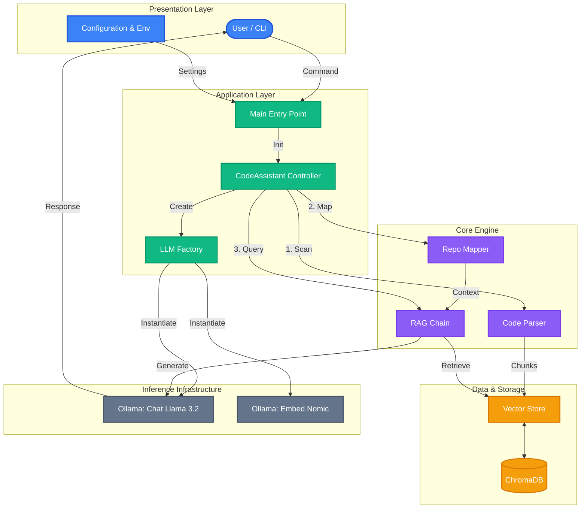

<div align="center">
  
  
  # Kavi.ai Code Assistant
  
  **The Production-Grade, Local-First RAG Code Assistant**
  
  [](https://opensource.org/licenses/MIT)
  [](https://www.python.org/downloads/)
  [](https://ollama.com/)
  [](https://github.com/psf/black)

  <p>
    <a href="#-quick-start">🚀 Quick Start</a> •
    <a href="#-features">✨ Features</a> •
    <a href="#-architecture">🏗️ Architecture</a> •
    <a href="#-configuration">⚙️ Configuration</a> •
    <a href="#-demo">👀 Demo</a>
  </p>
</div>

---

## 💡 Overview

**Kavi.ai Code Assistant** is a powerful, privacy-focused tool that turns your codebase into a knowledgeable partner. Unlike standard "chat with pdf" tools, this assistant strictly understands **code structure**.

It uses **AST (Abstract Syntax Tree) Parsing** to respect function and class boundaries, ensuring that when you ask about a feature, the AI reads the *actual* code logic, not just random text fragments.

**Key capabilities:**
*   **100% Offline**: Runs locally with Ollama (Llama 3.2, Mistral). No API keys required.
*   **Deep Understanding**: Uses Tree-sitter to parse Python code structurally.
*   **Repository Mapping**: Creates a coherent "mental map" of your entire project structure.
*   **Source Citations**: Every answer cites the exact files and code chunks used.

---

## 🚀 Quick Start

### 1. Prerequisites
*   [Python 3.10+](https://www.python.org/)
*   [Ollama](https://ollama.com/) (Download & Install)

### 2. Prepare the Brain
Pull the necessary models (Llama 3.2 for chat, Nomic for embeddings).
```bash
ollama pull llama3.2
ollama pull nomic-embed-text
```

### 3. Install
```bash
git clone https://github.com/machhakiran/Code-Assistant-AI.git
cd Code-Assistant-AI

# Create virtual environment
python3 -m venv venv
source venv/bin/activate

# Install dependencies (requires C++ build tools for ChromaDB)
pip install -r requirements.txt
```

### 4. Run It!
Chat with the assistant about *its own code* immediately:
```bash
python main.py --repo . --interactive
```

---

## 👀 Demo

The **Interactive CLI** features a beautiful, developer-friendly interface with rich markdown support.

```text
╭──────────────────────────────────────────────────────────╮
│                                                          │
│     __ ___         _           _                         │
│    / //_ /__ __ __(_)  ___ _  (_)                        │
│   / ,< / _ `/ |/ / /  / _ `/ / /                         │
│  /_/|_|\_,_/|___/_/   \_,_/ /_/                          │
│                                                          │
│       Code Assistant AI                                  │
│                                                          │
╰───────────────── Powered by RAG & LLMs ──────────────────╯
✓ System Ready

You: How does the VectorStore work?

Assistant:
The VectorStore class uses ChromaDB to store semantic embeddings...
```

---

## ✨ Features

### 🔍 Semantic Search (RAG)
Instead of keyword matching, we use **Vector Embeddings** to find code that matches the *intent* of your query.

### 🧠 AST Parsing Strategy
We don't blindly chop text. We use **Tree-sitter** to ensure that if a function is retrieved, the **whole function** is retrieved.

| Feature | Standard Splitters | **Our AST Parser** |
| :--- | :--- | :--- |
| **Boundaries** | Random character counts | Logical Functions/Classes |
| **Context** | Often cuts mid-logic | Preserves semantic integrity |
| **Accuracy** | Low | **High** |

### 🗺️ Repository Mapping
Before answering, the AI looks at a generated **Context Map** of your project (file tree + signatures). This helps it understand *where* to look before it even starts reading code.

---

## 🏗️ Architecture

The system uses a modern **Retrieval-Augmented Generation (RAG)** pipeline optimized for local execution.



### Coding Flow
1.  **Ingest**: Scan all `.py` files.
2.  **Parse**: Extract functions/classes using Tree-sitter.
3.  **Embed**: Convert code to vectors using `nomic-embed-text`.
4.  **Store**: Save to local ChromaDB.
5.  **Query**: Retrieve relevant chunks + Global Map -> Send to LLM.

---

## ⚙️ Configuration

Control the assistant via Environment Variables (`.env`) or CLI arguments.

**Default Configuration (`src/config.py`):**
```python
LLM_PROVIDER = "ollama"         # or "openai"
LLM_MODEL = "llama3.2"         # or "gpt-4", "mistral"
EMBEDDING_MODEL = "nomic-embed-text"
BASE_URL = "http://localhost:11434"
```

**Override Example:**
```bash
# Use OpenAI GPT-4 instead of local Ollama
export OPENAI_API_KEY="sk-..."
python main.py --repo . --provider openai --model gpt-4
```

---

<div align="center">
  <p>Built with ❤️ by the <strong>Kavi.ai</strong> Team</p>
  <p><i>Empowering Developers with Local AI</i></p>
</div>
